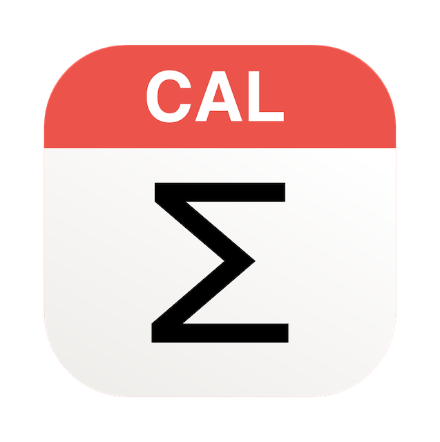
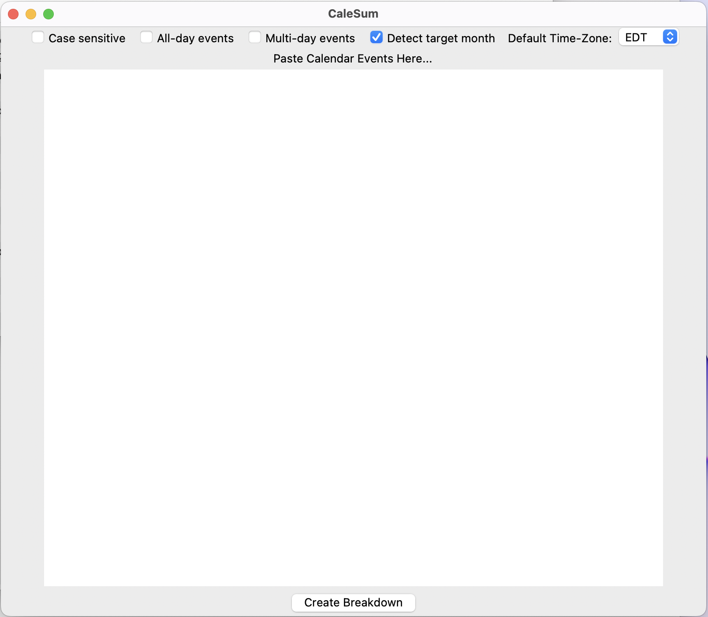
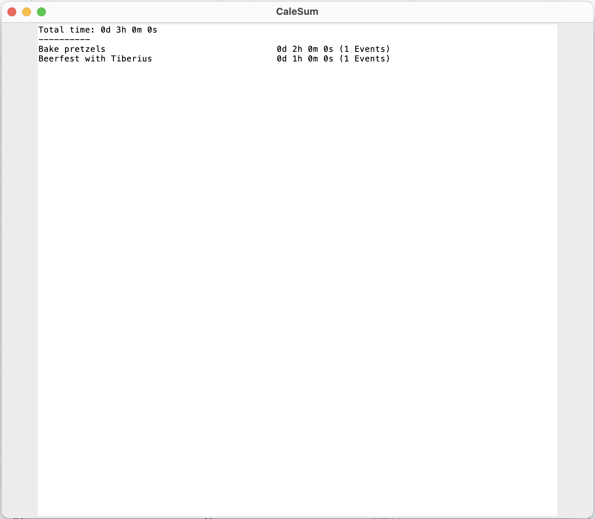

# CaleSum


-*Measuring what matters*-



## About

*CaleSum* is a simple tool for MacOS, to rapidly figure out how you spend your time. It operates on events copied from
MacOS's integrated calendar and produces a textual event summary report.

## Usage

1) Open your Mac calendar app, switch to monthly view. Then copy all events using `Command-A`, `Command-C`:  
   

2) Open `CaleSum` and paste your events.  
   

    * `CaleSum` automatically detects the month in question. Don't worry about single events in the trailing previous or past month, those are automatically excluded.
    * *All-day* events and *Multi-day* events likely have no intuitive notion of time, those are filtered too.
    * Event titles are gathered ignoring `Case Sensistive` matching. 

 > Hint: You can use the top-bar checkboxes to override this behaviour.

3) Hit `Create Breakdown`.  
   

## Builds

Prebuilt Mac applications are ready for download, [here](https://github.com/m5c/CaleSum/releases).

## Compile from Sources

### Install Requirements

This requires a *recent* version of python and tkinter, to
support [apple silicon](https://support.apple.com/en-ca/HT211814).

* `brew install python3`
* `brew install python-tk`

Brew may not update the system interpreter. If needed set an alias, and manually set the IDE interpreter:

```bash
alias python='/opt/homebrew/Cellar/python@3.11/3.11.5/bin/python3'
alias python3='/opt/homebrew/Cellar/python@3.11/3.11.5/bin/python3'
```

### Build Mac Application

Comment out these lines in `launcher.py`:

```
img = Image("photo", file="icon.png")
frame.tk.call('wm','iconphoto', frame._w, img)
```

To build a native MacOS app:

* Install `pip install pyinstaller`
* Run `./build.sh`
* Mac application is on Desktop.

## Author / Pull Requests

* Author: Maximilian Schiedermeier
* Github: [m5c](https://github.com/m5c)
* Webpage: https://www.cs.mcgill.ca/~mschie3
* License: [MIT](https://opensource.org/licenses/MIT)
