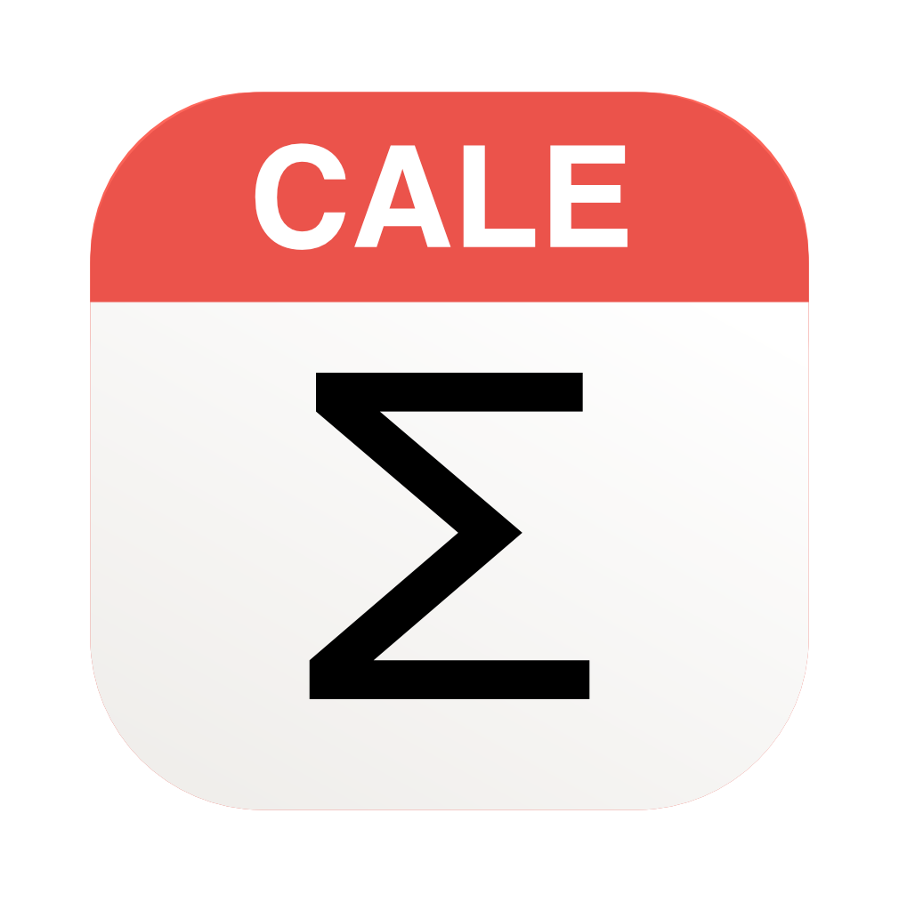
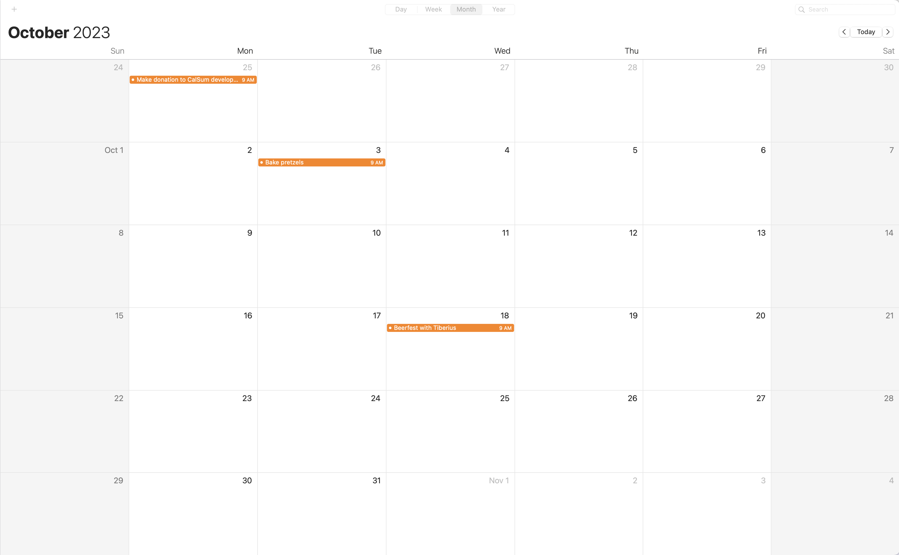

# CaleSum



A simple tool for MacOS to quickly figure our how much time you spent on tasks.

## Usage

 1) Open your Mac calendar app, switch to monthly view. Then copy all events using `Command-A`, `Command-C`:  


 2) Open `CaleSum` and paste your events.  


    * By default, `CaleSum` automatically detects the month in questino, even if there are events in last days of previous month / first days of next month.
    * All day events and multi-day events likely have no intuitive notion of time, by default these will are filtered. You can include them using the checkbox options.
    * By default, event titles are grouped without `Case Sensistive` matching. If you want to distinguish between events of different upper / lower case writing, check te box.  

 3) Hit 'Create Breakdown`.  


## Install Instructions

This requires a *recent* version of python and tkinter, to support [apple silicon](https://support.apple.com/en-ca/HT211814).

 * `brew install python3`
 * `brew install python-tk`

Brew may not update the system interpreter. If needed set an alias, and manually set the IDE interpreter:

```bash
alias python='/opt/homebrew/Cellar/python@3.11/3.11.5/bin/python3'
alias python3='/opt/homebrew/Cellar/python@3.11/3.11.5/bin/python3'
```

## Run Instructions

Clone this project, then run from the base directory:  

`python -m calendar_intel.launcher`

## Build Instructions

Comment out these lines in `launcher.py`:

```
img = Image("photo", file="icon.png")
frame.tk.call('wm','iconphoto', frame._w, img)
```

To build a native mac app:

 * Install `pip install pyinstaller`
 * Run `./build.sh`
 * Mac application is on Desktop.

## Author / Pull Requests

 * Author: Maximilian Schiedermeier
 * Github: [m5c](https://github.com/m5c)
 * Webpage: https://www.cs.mcgill.ca/~mschie3
 * License: [MIT](https://opensource.org/licenses/MIT)
